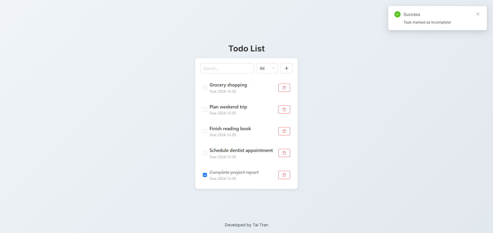

# Todo List Project
## Introduction
The Todo List project is a simple task management application that allows users to add, delete, and update the status of tasks. Below is a guide to install and run this project on your local machine.



## Installation

### Step 1: Clone the Repository
```bash
git clone https://github.com/taitranhuu2302/todo-list.git
cd todo-list
```

### Step 2: Install Dependencies
```bash
yarn install
```

### Running the Project
#### Run the Application in Development Mode
To run the application in development mode, use the following command:
```bash
yarn start:dev
```
This command will start the Vite application and concurrently run a JSON server to store data for the Todo List application.

## Features
- User-friendly interface for easy task management.
- Search and filter tasks by status (completed, incomplete).
- Supports adding, and deleting tasks.
- Allows setting deadlines for each task.

## Project Structure
The project follows this directory structure:
```bash
node_modules/
public/ 
server/
src/
├── assets/
├── components/ 
│   ├── index.ts
│   ├── Modal/
│   │   └── AddTaskModal.tsx
│   │   └── index.ts
│   └── Todo/
│       ├── TodoItem.tsx
│       └── TodoList.tsx
│       └── index.ts
├── config/
│   ├── axios.ts
│   └── index.ts
├── constants/
│   ├── index.ts
│   └── query.ts
├── services/
│   ├── index.ts
│   ├── tasks/
│   │   ├── index.ts
│   │   ├── useCreateTask.ts
│   │   ├── useDeleteTask.ts
│   │   ├── useGetTasks.ts
│   │   └── useUpdateTask.ts
├── types/
│   ├── index.ts
│   └── task.ts
├── App.tsx
├── index.tsx
├── main.ts
├── vite-env.d.ts
└── App.css
.gitignore
eslint.config.js
.prettierrc 
package.json
```

